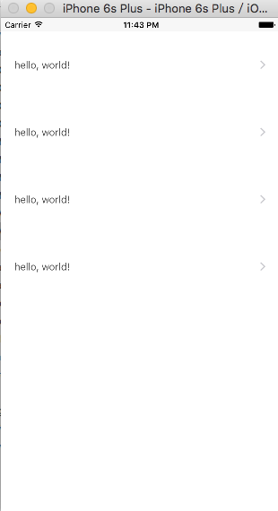
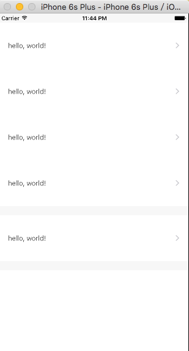
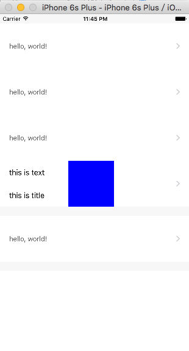

# iOS-XMTableView
本人新手，初试iOS，一个简单封装的UITableViewController

支持
-----
* 单Cell复用、支持多Cell
* 支持布局自定义，简单方便
* 集成系统下拉刷新

使用示例
--------
```objc
self.cellClass = [XMTestCell class];
self.dataArray = [[NSMutableArray alloc] initWithArray:@[obj1, obj1, obj1, obj1]];
```


```objc
self.dataGrounp = YES;
self.dataArray = [[NSMutableArray alloc] initWithArray:@[@[obj1, obj1, obj1, obj1],@[obj1]]];
```


```objc
self.dataGrounp = YES;
self.dataArray = [[NSMutableArray alloc] initWithArray:@[@[obj1, obj1, obj1, obj2],@[obj1]]];
```


#####下拉刷新，并重写XMPullRefresh()
```objc

[self setXMPullRefresh];

- (void)XMPullRefresh {
    //[self.refreshControl endRefreshing];
}
```

#####选中事件处理
```objc
- (void)tableView:(UITableView *)tableView didSelectRowAtIndexPath:(NSIndexPath *)indexPath {
    XMTableObject *object = [self ModelForCellAtIndexPath:indexPath];
//    UIViewController *Vc = [[object.ViewControllerClass alloc] init];
//    [self.navigationController pushViewController:Vc animated:YES];
}
```

建议搭配
--------
* [SDAutoLayout](https://github.com/gsdios/SDAutoLayout) 一行代码搞定自动布局！支持高度自适应.
* [MJRefresh](https://github.com/CoderMJLee/MJRefresh) 强大的下拉刷新框架：一行代码搞定.

联系方式
--------
  有问题？请[推特](https://twitter.com/huangxy) 或者 [发邮件](mailto:huangxy8023@foxmail.com).

许可证
----------

    Copyright 2016 huangxy@GitSmark

    Licensed under the Apache License, Version 2.0 (the "License");
    you may not use this file except in compliance with the License.
    You may obtain a copy of the License at

       http://www.apache.org/licenses/LICENSE-2.0

    Unless required by applicable law or agreed to in writing, software
    distributed under the License is distributed on an "AS IS" BASIS,
    WITHOUT WARRANTIES OR CONDITIONS OF ANY KIND, either express or implied.
    See the License for the specific language governing permissions and
    limitations under the License.
